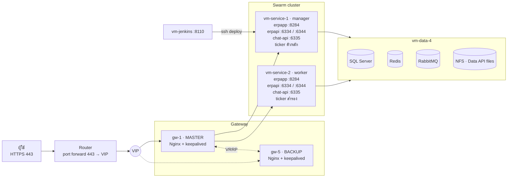

# Architecture

## Diagram

แบบ Mermaid (แก้ง่ายใน Git):

## Routing ที่ gateway

| Domain / path | Upstream | Port บน vm-service | การกระจาย |
|---|---|---|---|
| `erp.nisolution.co.th` | erpapp | 8284 (ingress) | least_conn |
| `api.nisolution.co.th` `/` | erpapi | 6334 (ingress) | least_conn |
| `api…` `/notificationhub` `/ticketcommenthub` `/chathub` `/tickettaskreplyhub` `/sessionhub` | erpapi_hubs | 6344 (host) | sticky ตาม IP |
| `api…` `/chat-api/` `/chat-liff-app/` `/socketionode/` LINE webhook | chatapi | 6335 (host) | sticky ตาม IP |
| `app.nisolution.co.th` | legacy_app | LEGACY_IP:3030 | เครื่องเดียว |
| `n8n.nisolution.co.th` | n8n | LEGACY_IP:5678 | เครื่องเดียว |
| `zabbix` `api-zabbix` `monitor-zb` | zbx_* | ZBX_HOST | เครื่องเดียว |

port แบบ **host mode** ทำให้ Nginx ส่งผู้ใช้คนเดิมไปถึง container ตัวเดิมจริง ซึ่ง SignalR และ socket.io ต้องการ

## Flow

### ปกติ
ผู้ใช้ → Router → VIP (gw-1) → vm-service-1 หรือ 2 → vm-data-4
โหลดแบ่งครึ่งระหว่าง 2 เครื่อง ส่วน chat และ SignalR ผู้ใช้คนเดิมไปเครื่องเดิมเสมอ

### gw-1 ล่ม
keepalived บน gw-5 ไม่ได้ยินสัญญาณจาก gw-1 จึงรับ VIP ไปเองภายใน 3–5 วินาที ไม่ต้องแก้ Router หรือ DNS
เมื่อ gw-1 กลับมา VIP ย้ายกลับเอง ส่วน WebSocket ที่หลุดจะ reconnect เอง

### vm-service-1 ล่ม
Nginx ตัดเครื่องที่ไม่ตอบออก ส่งงานทั้งหมดไป vm-service-2 และ ticker ย้ายไป vm-service-2
ระหว่างนี้ deploy ไม่ได้จนกว่า vm-service-1 (manager) กลับมา

### Deploy
vm-jenkins build + push image → ssh vm-service-1 → แก้ `versions.env` → `docker stack deploy` → Swarm อัปเดตทีละเครื่อง
ถ้า health ไม่ผ่านจะ rollback เองและ job Jenkins ขึ้น fail

## Resource

สูตร: Disk = (storage + image) × 1.4 · RAM = ค่าที่วัดได้ × 1.2
Spec VM = ค่าที่ได้ + OS (RAM 1 GB, disk 20 GB) แล้วปัดขึ้นเป็นขนาดมาตรฐาน

| VM | Disk ใช้ (+40%) | RAM ใช้ (+20%) | vCPU | RAM แนะนำ | Disk แนะนำ |
|---|---:|---:|---:|---:|---:|
| gw-1 | – | 0.1 GB | 1 | 2 GB | 20 GB |
| gw-5 | – | 0.1 GB | 1 | 2 GB | 20 GB |
| vm-service-1 | 4.6 GB | 4.3 GB | 4 | 8 GB | 40 GB |
| vm-service-2 | 4.6 GB | 4.3 GB | 4 | 8 GB | 40 GB |
| vm-data-4 | 37.9 GB | 1.3 GB | 4 | 4 GB (8 GB ถ้า DB โต) | 60 GB + backup 60 GB |
| vm-jenkins | 1.9 GB | 3.0 GB | 2 | 4 GB | 40 GB |
| **รวม** | **49.0 GB** | **13.1 GB** | **16** | **28 GB** | **280 GB** |

ค่าที่วัดมาราย service

| VM | Service | Storage | Image | RAM |
|---|---|---:|---:|---:|
| vm-service-1/2 | erpapp :8284 | 500 MB | 204 MB | 2 GB |
| | erpapi :6334, :6344 | (อยู่ที่ vm-data-4) | 407 MB | 1 GB |
| | chat-api :6335 | 800 MB | 873 MB | 500 MB |
| | ticker | 200 MB | ~400 MB (ประมาณ) | 100 MB |
| vm-data-4 | SQL Server | 20 GB | 2 GB | 1 GB |
| | Redis | 1 GB | 117 MB | 9 MB |
| | RabbitMQ | 2 GB | 267 MB | 81 MB |
| | Data API files (NFS) | 1.7 GB | – | – |
| vm-jenkins | Jenkins :8110 | 904 MB | 470 MB | 2.5 GB |
| gw-1 / gw-5 | Nginx + keepalived | – | – | 100 MB |

ใน `stack.yml` ตั้ง erpapp, erpapi และ chat-api เป็น `mode: global` (เครื่องละ 1 ตัว) ถ้าเครื่องหนึ่งล่ม Swarm จะไม่ย้ายตัวที่สองมาซ้อน
เครื่องที่เหลือจึงใช้ RAM เท่าเดิม แต่ต้องรับโหลดทั้งหมดคนเดียว

## จุดเสียจุดเดียวที่ยังเหลือ

- **vm-data-4:** ถ้าล่ม ระบบล่มทั้งหมด ต้องมี backup นอกเครื่องและซ้อม restore
- **Swarm manager บน vm-service-1:** ถ้าล่ม แอปยังทำงานบน vm-service-2 แต่ deploy ไม่ได้
