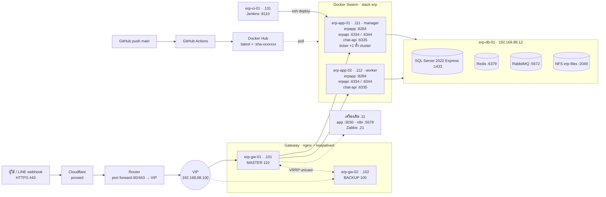

# Architecture

## Diagram


แบบ Mermaid (แก้ง่ายใน Git):



## Routing ที่ gateway

| Domain / path | Upstream | Port บน vm-service | การกระจาย |
|---|---|---|---|
| `erp.nisolution.co.th` | erpapp | 8284 (ingress) | least_conn |
| `api.nisolution.co.th` `/` | erpapi | 6334 (ingress) | least_conn |
| `api…` `/notificationhub` `/ticketcommenthub` `/chathub` `/tickettaskreplyhub` `/sessionhub` | erpapi_hubs | 6344 (host) | sticky ตาม IP |
| `api…` `/chat-api/` `/chat-liff-app/` `/socketionode/` LINE webhook | chatapi | 6335 (host) | sticky ตาม IP |
| `app.nisolution.co.th` | legacy_app | LEGACY_IP:3030 | เครื่องเดียว |
| `n8n.nisolution.co.th` | n8n | LEGACY_IP:5678 | เครื่องเดียว |
| `zabbix` `api-zabbix` `monitor-zb` | zbx_* | ZBX_HOST | เครื่องเดียว |

port แบบ **host mode** ทำให้ Nginx ส่งผู้ใช้คนเดิมไปถึง container ตัวเดิมจริง ซึ่ง SignalR และ socket.io ต้องการ

## Cloudflare และ VIP

```
ผู้ใช้ → Cloudflare (proxied) → public IP ของ router :443 → dst-nat → VIP 192.168.88.100 → erp-gw-01 / erp-gw-02
คนในออฟฟิศ → DNS ภายใน → VIP 192.168.88.100 ตรง (ไม่อ้อมออก internet)
```

- VIP เป็น IP ภายใน ข้างนอกไม่เห็น ข้างนอกเห็นแค่ IP ของ Cloudflare หรือ public IP ของ router
- `gateway/nginx/conf.d/06-cloudflare-realip.conf` ทำให้ Nginx ใช้ `CF-Connecting-IP` เป็น IP ผู้ใช้ ซึ่งจำเป็นต่อ sticky ของ hub/chat และ log
- router รับ 80/443 เฉพาะจาก IP ของ Cloudflare กันคนยิงตรงเข้า public IP (ตัวอย่าง MikroTik: `docs/router/mikrotik-cloudflare.rsc`)
- Cloudflare SSL/TLS ตั้งเป็น **Full (strict)** ใช้ wildcard cert เดิมบน gateway ได้เลย
- Cloudflare แผน Free/Pro รับ upload ได้ไม่เกิน 100 MB ต่อ request แม้ Nginx ของ api จะตั้งไว้ 120M
- รายการ IP ของ Cloudflare เปลี่ยนนาน ๆ ครั้ง ให้เช็ก https://www.cloudflare.com/ips/ ปีละครั้ง

## Flow

### ปกติ
ผู้ใช้ → Cloudflare → Router → VIP (erp-gw-01) → erp-app-01 หรือ erp-app-02 → erp-db-01
โหลดแบ่งครึ่งระหว่าง 2 เครื่อง ส่วน chat และ SignalR ผู้ใช้คนเดิมไปเครื่องเดิมเสมอ

### erp-gw-01 ล่ม
keepalived บน erp-gw-02 ไม่ได้ยินสัญญาณจาก erp-gw-01 จึงรับ VIP ไปเอง (nginx ถูกเช็กทุก 1 วินาที ล้ม 2 ครั้ง = ย้าย ใช้เวลาราว 2–3 วินาที) ไม่ต้องแก้ Router หรือ DNS
เมื่อ erp-gw-01 กลับมา VIP ย้ายกลับเอง ส่วน WebSocket ที่หลุดจะ reconnect เอง

### erp-app-01 ล่ม
Nginx ตัดเครื่องที่ไม่ตอบออก ส่งงานทั้งหมดไป erp-app-02 และ ticker ย้ายไป erp-app-02
ระหว่างนี้ deploy ไม่ได้จนกว่า erp-app-01 (manager) กลับมา

### Deploy
push `main` ของแอป → GitHub Actions build แล้ว push image `:latest` + `:sha-<7 ตัว>` ขึ้น Docker Hub
→ กด Build job `deploy-<แอป>` บน Jenkins (erp-ci-01) → ssh `deploy@erp-app-01` → `docker pull` แล้วอ่าน digest
→ แก้ `versions.env` เป็น `latest@sha256:<digest>` → `deploy-stack.sh` → `wait-converge.sh` รอจนอัปเดตเสร็จ → แจ้ง Slack
`deploy-stack.sh` อ่าน `STACK_MODE` ใน `versions.env`: `test` (ค่าเริ่มต้น) ใส่ `stack.test.yml` บล็อก LINE / push / Gmail ออก, `live` ใช้ตอน cutover
ถ้า health ไม่ผ่านจะ rollback เองและ job Jenkins ขึ้น fail

## Resource

สูตร: Disk = (storage + image) × 1.4 · RAM = ค่าที่วัดได้ × 1.2
Spec VM = ค่าที่ได้ + OS (RAM 1 GB, disk 20 GB) แล้วปัดขึ้นเป็นขนาดมาตรฐาน

| VM | Disk ใช้ (+40%) | RAM ใช้ (+20%) | vCPU | RAM แนะนำ | Disk แนะนำ |
|---|---:|---:|---:|---:|---:|
| erp-gw-01 | – | 0.1 GB | 1 | 2 GB | 20 GB |
| erp-gw-02 | – | 0.1 GB | 1 | 2 GB | 20 GB |
| erp-app-01 | 4.6 GB | 4.3 GB | 4 | 8 GB | 40 GB |
| erp-app-02 | 4.6 GB | 4.3 GB | 4 | 8 GB | 40 GB |
| erp-db-01 | 37.9 GB | 1.3 GB | 4 | 4 GB (8 GB ถ้า DB โต) | 60 GB + backup 60 GB |
| erp-ci-01 | 1.9 GB | 3.0 GB | 2 | 4 GB | 40 GB |
| **รวม** | **49.0 GB** | **13.1 GB** | **16** | **28 GB** | **280 GB** |

ค่าที่วัดมาราย service

| VM | Service | Storage | Image | RAM |
|---|---|---:|---:|---:|
| erp-app-01/2 | erpapp :8284 | 500 MB | 204 MB | 2 GB |
| | erpapi :6334, :6344 | (อยู่ที่ erp-db-01) | 407 MB | 1 GB |
| | chat-api :6335 | 800 MB | 873 MB | 500 MB |
| | ticker | 200 MB | ~400 MB (ประมาณ) | 100 MB |
| erp-db-01 | SQL Server | 20 GB | 2 GB | 1 GB |
| | Redis | 1 GB | 117 MB | 9 MB |
| | RabbitMQ | 2 GB | 267 MB | 81 MB |
| | Data API files (NFS) | 1.7 GB | – | – |
| erp-ci-01 | Jenkins :8110 | 904 MB | 470 MB | 2.5 GB |
| erp-gw-01 / erp-gw-02 | Nginx + keepalived | – | – | 100 MB |

ใน `stack.yml` erpapp เป็น `mode: global` (เครื่องละ 1 ตัว) ส่วน erpapi และ chat-api เป็น `mode: replicated` จำนวนตาม `ERPAPI_REPLICAS` / `CHATAPI_REPLICAS`
(ตั้ง 2 ทั้งคู่) กับ `max_replicas_per_node: 1` ถ้าเครื่องหนึ่งล่ม Swarm จะไม่ย้ายตัวที่สองมาซ้อน เพราะ host port ซ้ำกันไม่ได้
เครื่องที่เหลือจึงใช้ RAM เท่าเดิม แต่ต้องรับโหลดทั้งหมดคนเดียว

## จุดเสียจุดเดียวที่ยังเหลือ

- **erp-db-01:** ถ้าล่ม ระบบล่มทั้งหมด ต้องมี backup นอกเครื่องและซ้อม restore
- **Swarm manager บน erp-app-01:** ถ้าล่ม แอปยังทำงานบน erp-app-02 แต่ deploy ไม่ได้
